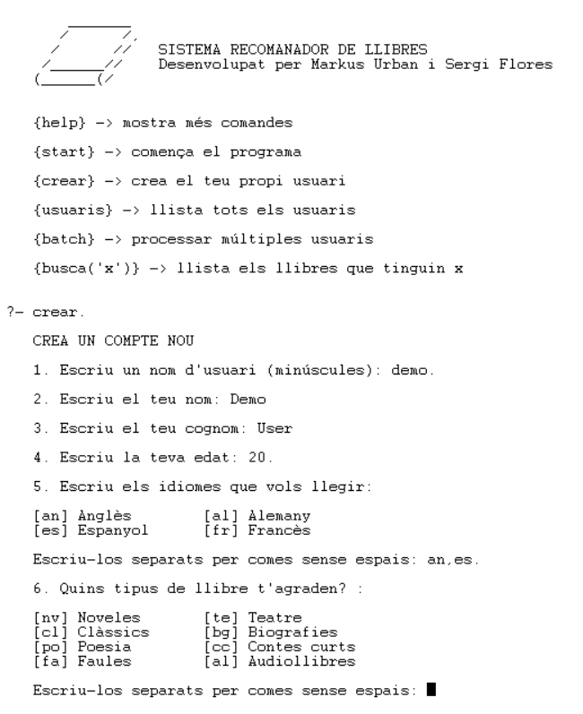
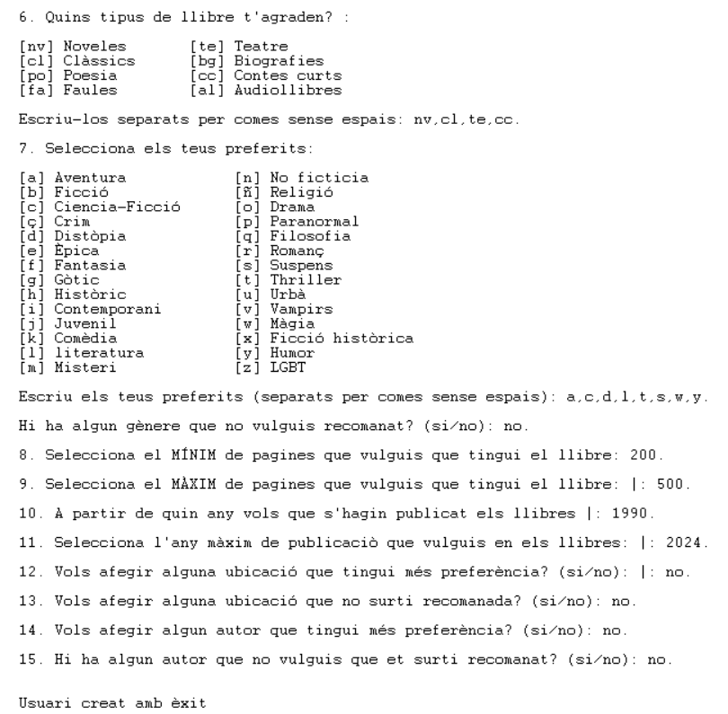
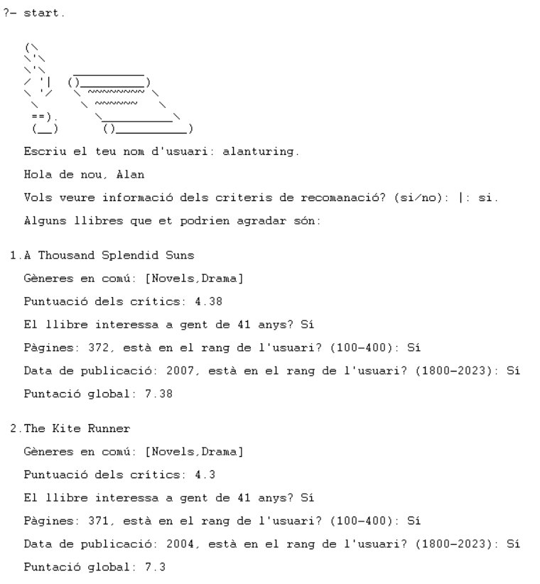
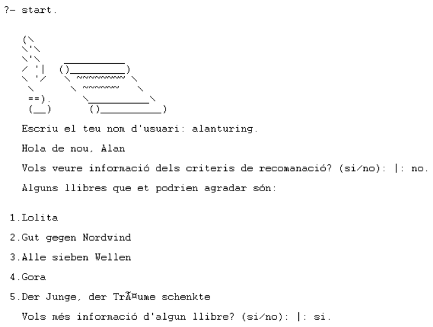

# Prolog Book Recommender
This project is a book recommender with prolog with a clear UI

# Description
The recommender is based on a database of 400 books with up to 13 parameters 
that thanks to a user creator can sugest interesting books depending on the preferences

# Commands
- help -> shows commands
- start -> starts the recommendation
- crear -> creates a new user
- usuaris -> shows all users
- batch -> processes multiple users
- busca -> searches on database

# Structure

## Users 
    -A unique identifier
    -First name
    -Last name
    -Age
    -Genres of interest
    -Latest publication year
    -Earliest publication year
    -Minimum length
    -Maximum length
    -Undesired settings
    -Undesired authors
    -Languages
    -Authors of interest
    -Locations of interest
    -Genres to avoid
    -Previous recommendations
Example:

    usuari(nom_usuari, Nom, Cognom, Edat, Gèneres, [Edició_posterior, Edició_anterior],
    [Extensió_mínima, Extensió_màxima], LlocsNoVol, AutorsNoVol, Idiomes, AutorsSiVol,
    LlocsSiVol, GèneresNoVol, Recomanacions).

## Books
    -Title of the book
    -Author
    -Rating
    -Language
    -Genres
    -Characters
    -Number of pages
    -Publisher
    -Year of publication
    -Locations of the action
Example:

    llibre("Les Misérables", "Victor Hugo", 4.18, "English", ['Classics',
    'Fiction', 'Historical Fiction', 'Literature', 'France', 'Historical',
    'Novels', 'French Literature', 'Romance', 'Classic Literature'], ['Jean
    Valjean', 'Javert', 'Cosette', 'Fantine', 'Bishop Myriel', 'M. & Mme.
    Thénardier', 'Marius Pontmercy', 'Enjolras', 'Éponine', 'Gavroche',
    'Azelma', 'Champmathieu', 'Fauchelevent', 'Grantaire', 'Mademoiselle
    Gillenorman', 'Felix Tholomyès', 'Toussaint', 'Combeferre', 'Jean
    Valjean, Javert, Fantine, Cosette, Marius Pontmercy', 'Jean Valjean',
    'Police Inspector Javert', 'Cosette', 'Fantine', 'Marius Pontmercy',
    'Éponine', 'Enjolras', 'Gavroche', 'Bishop of Digne', 'Grantaire',
    'Bahorel', 'Bossuet'], 1463, "Signet Classics", 1987, ['Paris
    (France)']).

# Recommendations

The recommendation system studies the criteria set by the user and calculates a score for the books that meet those criteria. The score calculation is based on a point system, allowing more or less weight to be assigned to each parameter considered.

The numerical value of each book is calculated by summing the points obtained for each parameter, and the recommendations are ordered in descending order of score. This enables the recommendation of a large number of books, although their relevance may decrease as the list goes on. By default, it recommends the 5 books most suited to the user, and this information is saved to their profiles to avoid repeating recommendations already made.

The recommendation system is divided into two parts. The first filters the books based on parameters the user does not want (such as undesired authors, cities, or genres). It also filters books according to the languages the user has selected. This ensures that no books with any undesired parameters are recommended to the user. Thus, we avoid recommendations with a negative parameter.

The point system is the second phase of book selection. Below, we detail the weights assigned to each characteristic. This approach has provided us with the most accurate results, but it can be modified internally to adjust the system’s behavior.

    -Common genres (1 point per genre)
    -Age (recommended for the age: 1 point; unknown: 0.5 points; no: 0 points)
    -Year of publication (1 point if the book is within the range set by the user)
    -Pages (1 point if the book is within the range set by the user)
    -Location (1 point if the book contains the location)
    -Author (1 point if the book contains one of the preferred authors)
    -Rating (critics' score minus 2)

Example:

    Water for Elephants
    Common genres: [Fiction, Novels] → 2 points
    Critics' rating: 4.09 → (4.09 - 2) = 2.09 points
    Interest to people aged 32?: Yes → 1 point
    Pages (335), within the user's range (200-350): Yes → 1 point
    Publication date (2007), within the user's range (2000-2023): Yes → 1 point
    Contains preferred locations?: Yes (New York) → 1 point
    Contains preferred authors?: No → 0 points
    Total score = 2 + 2.09 + 1 + 1 + 1 + 1 + 0 = 8.09 points

